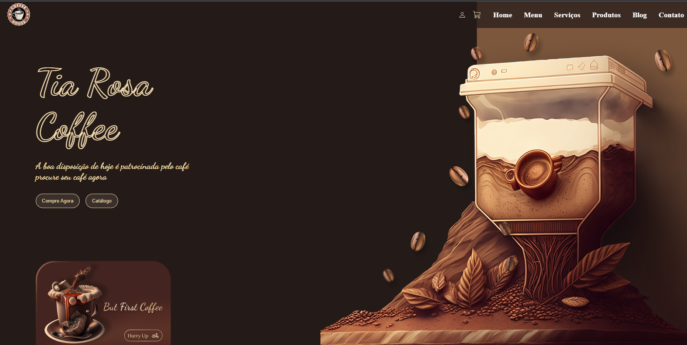
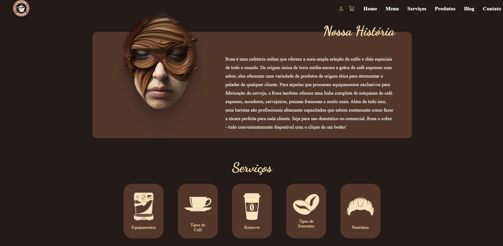
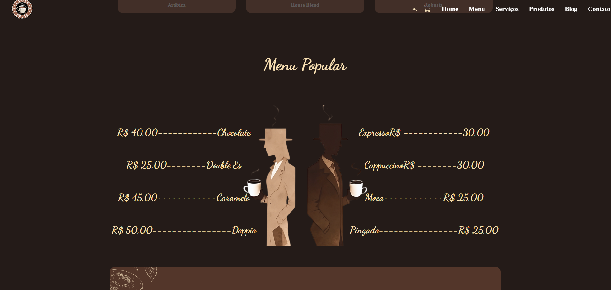
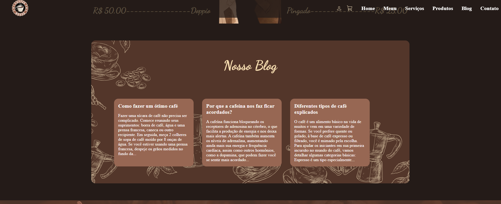

<h1> Tia Rosa Coffe </h1>

<h2> Link para acessar: </h2>
https://coffee-page-nine.vercel.app/

<h2> Sobre o Projeto </h2>

<h4> Olá bem vindo ao meu projeto, nele foi desenvolvido uma landing page em HTML e CSS onde temos: </h4>

<ul>
  <li>Menu de Serviços</li>
  <li>Menu de Ofertas</li>
  <li>Card de Reserva</li>
  <li>Cafés Recomendados</li>
  <li>Cardápio</li>
  <li>Card de Blog</li>
  
</ul>

<h2> O que eu aprendi? </h2>

<h5>Aprendi a estilizar mais com flex container</h5>

<h2>Desenvolvido por:</h2>
<h3>Douglas Miranda</h3>
https://www.linkedin.com/in/douglas-miranda-939513247/

